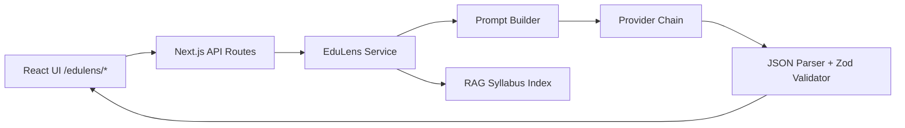
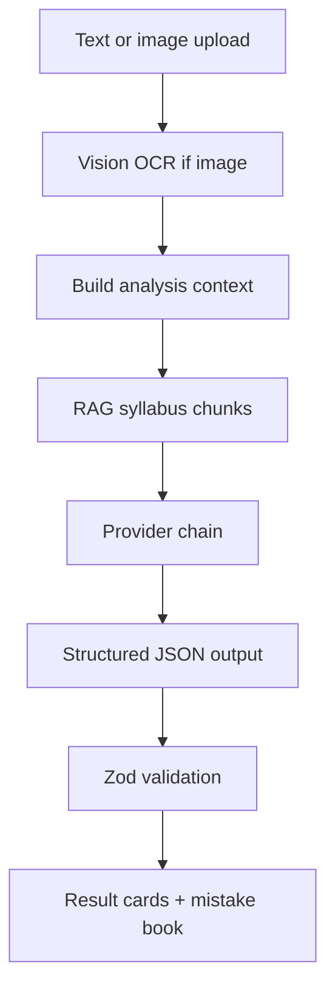

# EduLens AI — Architecture

## System overview

## Homework analysis flow

## AI provider chain

| Provider | Use case |
|----------|----------|
| Agnes | Text + vision (recommended) |
| Gemini | Text + vision |
| Groq | Fast text |
| OpenRouter | Free model fallback |
| Mock | Demo without API keys |

Environment: `EDULENS_AI_MODE`, `EDULENS_PROVIDER_CHAIN` (set in Vercel, not git).

## RAG layer

- Indexed syllabus PDFs in local `syllabus/` folder
- Chunk retrieval with budget scaling for large-context models
- Web RAG optional (disabled in demo mode on Vercel)

## Deployment

| Component | Location |
|-----------|----------|
| Source (private) | `mentorkokkwa/leo-suite-edutech` |
| Vercel project | `leo-suite-edutech` @ vercel.com/cenzhi |
| Public docs | `mentorkokkwa/leo-suite-edutech-showcase` |

## Tech stack

- Next.js 16 (App Router)
- React 19, TypeScript, Zod
- Tailwind CSS 4
- Export: PDF (jsPDF), DOCX, PPTX

## Data

Homework history and mistake book stored in browser `localStorage`. No server database in MVP.
