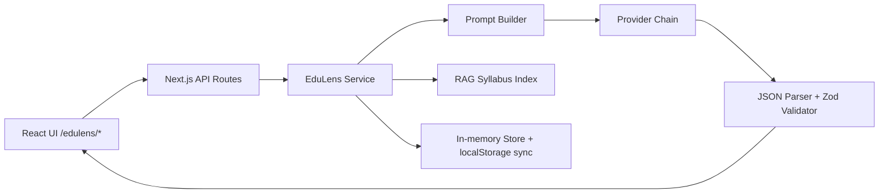

# EduLens AI — Portfolio Project Document

**Author:** Liu Cenzhi (刘岑之)  
**Project:** Leo Suite — EduLens AI  
**Category:** DSA-JC Computing / AI for Smarter Schools  
**Version:** June 2026  
**Live Demo:** https://leo-suite-edutech-six.vercel.app/edulens  
**Public Showcase:** https://github.com/mentorkokkwa/leo-suite-edutech-showcase  

---

## Table of Contents

1. [Executive Summary](#1-executive-summary)
2. [Background & Problem Statement](#2-background--problem-statement)
3. [Target Users & Use Cases](#3-target-users--use-cases)
4. [Product Vision & Design Goals](#4-product-vision--design-goals)
5. [Core Features (Detailed)](#5-core-features-detailed)
6. [System Architecture](#6-system-architecture)
7. [AI System Design](#7-ai-system-design)
8. [RAG & Syllabus Integration](#8-rag--syllabus-integration)
9. [Visual Lesson Engine](#9-visual-lesson-engine)
10. [Quality, Safety & Privacy](#10-quality-safety--privacy)
11. [Development Process & Testing](#11-development-process--testing)
12. [Deployment & Demo Strategy](#12-deployment--demo-strategy)
13. [Commercial Roadmap & Social Impact](#13-commercial-roadmap--social-impact)
14. [Reflection & Future Work](#14-reflection--future-work)
15. [Appendix: Links & Repository Strategy](#15-appendix-links--repository-strategy)

---

## 1. Executive Summary

**EduLens AI** is a structured AI teaching assistant I designed and built as part of the **Leo Suite** — a three-app EdTech portfolio covering student wellbeing (YouthMentor), teaching intelligence (EduLens), and robotics simulation (CampusBot).

EduLens addresses a concrete classroom pain point: teachers spend large amounts of time marking homework and preparing differentiated materials, while students often receive only a final score without structured feedback on *why* they made mistakes or *what* to practise next.

My solution is not a generic chatbot. EduLens returns **validated, structured JSON** — marking-style feedback, mistake type classification, similar practice questions, syllabus-aware lesson plans, worksheets, visual learning animations, and exportable PDF/DOCX/PPTX reports. The system is built on **Next.js 16**, uses a **multi-provider LLM chain** with automatic mock fallback for reliable demos, and includes a **RAG-lite syllabus layer** aligned to Singapore MOE curriculum topics.

The application is deployed live on Vercel and documented in a public showcase repository. Full source code, API routes, and prompt templates remain in a **private deployment repository** to protect intellectual property and API configuration — a deliberate portfolio strategy recommended for DSA submissions involving production AI systems.

**Key metrics of the build:**

| Dimension | Detail |
|-----------|--------|
| Tech stack | Next.js 16, React 19, TypeScript, Tailwind CSS 4, Zod |
| Codebase (private) | ~90 library modules under `src/lib/edulens/` |
| API routes | 9 server endpoints for homework, lessons, dashboard, OCR |
| AI providers | Agnes, Gemini, Groq, OpenRouter, OpenAI, Mock |
| Export formats | PDF, DOCX, PPTX, animated lesson export |
| Data storage | Browser `localStorage` (no server database in MVP) |
| Tests | Unit tests for prompt builder, JSON parser, visual type detection, RAG retrieval |

---

## 2. Background & Problem Statement

### 2.1 The marking bottleneck

In secondary school mathematics and science, a single worksheet may contain 8–15 questions. A teacher marking 35 students can spend 2–4 hours on one assignment. Even when marking is complete, written feedback is often brief — a tick, a cross, or a single-line comment — because time is limited.

Students, meanwhile, need more than a score. Research on formative assessment consistently shows that **timely, specific feedback** on error patterns improves retention and reduces repeated mistakes. Yet most AI homework tools today either:

- Give free-form chat replies that are hard to compare across students, or
- Return a single "correct answer" without rubric-style breakdown, or
- Require expensive enterprise LMS integration inaccessible to individual students.

### 2.2 Why structured output matters

Large language models are strong at natural language but weak at consistency unless constrained. For an educational product, inconsistent output formats break downstream features: mistake books, dashboards, printable reports, and teacher review workflows all depend on **predictable data shapes**.

EduLens was designed around this principle: every AI response passes through a **Zod schema validator** before reaching the UI. If parsing fails, the system retries or falls back to the next provider — or to seeded mock data in demo mode.

### 2.3 My motivation

As a student building for DSA-JC Computing, I wanted to demonstrate:

1. **Full-stack engineering** — not just prompting ChatGPT, but building API routes, validation, export pipelines, and deployment.
2. **Responsible AI** — disclaimers, teacher-review flags, and demo mode that works without leaking API keys.
3. **Real-world product thinking** — freemium tiers, syllabus alignment, and a sibling app (YouthMentor) with hard safety guardrails.

EduLens sits in the "AI for Smarter Schools" theme: augmenting teachers, not replacing them.

---

## 3. Target Users & Use Cases

### 3.1 Primary personas

| Persona | Need | How EduLens helps |
|---------|------|-------------------|
| **Secondary student (13–18)** | Understand mistakes after homework | Structured feedback, mistake book, similar questions |
| **Teacher / tutor** | Draft lesson materials faster | Lesson generator with syllabus RAG, PDF/DOCX export |
| **Parent** | Monitor learning patterns (future) | Dashboard stats from local history |
| **School IT / reviewer (DSA)** | Evaluate AI EdTech safely | Mock mode demo, public docs, no source leak |

### 3.2 Representative use cases

**Use case A — Homework photo upload**

A student photographs a completed math worksheet. EduLens runs vision OCR (when real AI is enabled), splits the text into questions, retrieves relevant syllabus chunks, and returns per-question scores, mistake types (`conceptual`, `calculation`, `careless`, `incomplete`, `method`), and improvement tips.

**Use case B — Lesson preparation**

A teacher enters "Quadratic equations — factorisation" with grade level O-Level. EduLens generates a lesson pack: objectives, worked examples, worksheet questions, assessment alignment, and optional visual animation steps (parabola graph, factor pairs, etc.).

**Use case C — Mistake pattern review**

After several analyses, the mistake book aggregates recurring error types. The student exports a PDF report for parent-teacher conference or self-study.

**Use case D — Portfolio demo (no API key)**

A reviewer opens the Vercel URL. Demo mode returns high-quality seeded analyses — no external API call, no cost, no key exposure.

---

## 4. Product Vision & Design Goals

### 4.1 Vision statement

> *Make structured, syllabus-aware AI feedback accessible to every student — with teachers always in the loop.*

### 4.2 Design principles

| Principle | Implementation |
|-----------|----------------|
| **Structure over chat** | JSON schemas for all AI outputs |
| **Teacher in the loop** | `teacherReviewRecommended` flag on analyses |
| **Demo reliability** | Mock mode with bilingual seeded content |
| **Provider resilience** | Chain: try provider A → B → C → mock |
| **Privacy by default** | No accounts, no server DB in MVP |
| **Syllabus alignment** | Indexed MOE topic catalog + PDF chunks |
| **Export-ready** | PDF, Word, PowerPoint pipelines |

### 4.3 What EduLens is NOT

- Not an official exam board or MOE-endorsed marking system
- Not automated plagiarism detection
- Not a replacement for teacher professional judgment
- Not real-time classroom proctoring

These boundaries are stated in-app and in the public safety design document.

---

## 5. Core Features (Detailed)

### 5.1 Homework Analyzer (`/edulens/homework-analyzer`)

**Input modes:**

- Paste text (questions + student answers)
- Upload image(s) — processed through vision OCR pipeline

**Output structure (validated JSON):**

```
HomeworkAnalysis
├── result (overall assessment text)
├── estimatedScore / rubricAnalysis
├── mistakeTypes[] (tagged categories)
├── mistakeBreakdown[] (per-error detail)
├── feedback[] (per-question cards)
├── similarQuestions / remedialQuestions / extensionQuestions
├── learningVisualLessons[] (optional animated steps)
├── learningPlan (structured next steps)
├── teacherReviewRecommended (boolean)
└── knowledgePoints[] (syllabus-linked)
```

**Sample type excerpt (public showcase repo):**

The showcase repository includes a non-sensitive type definition in `sample/homework-result-types.ts` showing the shape reviewers can expect — without exposing Zod schemas or prompts.

### 5.2 Lesson Generator (`/edulens/lesson-generator`)

Generates a **lesson pack** containing:

- Lesson plan (objectives, timing, differentiation)
- Worksheet with graded difficulty
- Visual learning steps with LaTeX support
- Concept maps for writing / humanities topics
- Assessment alignment checks against syllabus expectations

**Multi-part generation:** Long lessons are fetched in parts to respect token limits, then merged and enriched (media, visuals, assessment alignment).

**Export options:**

| Format | Library / approach |
|--------|-------------------|
| PDF | jsPDF with math rendering |
| DOCX | Structured document builder |
| PPTX | Slide generation from lesson steps |
| Animation | Step-by-step visual export |

### 5.3 Mistake Book (`/edulens/mistake-book`)

Persists analysis history in browser `localStorage`. Groups entries by mistake type and knowledge point. Enables students to see patterns ("3 calculation errors on quadratics this week") rather than isolated scores.

### 5.4 Dashboard (`/edulens/dashboard`)

Aggregates usage stats: analyses run, common mistake types, recent activity. API route `/api/edulens/dashboard` serves computed stats from the in-memory / local store.

### 5.5 Reports (`/edulens/reports/[id]`)

Printable report view for a single analysis — suitable for sharing with teachers or parents.

### 5.6 AI Status (`/api/edulens/ai-status`)

Public endpoint showing active provider, mode (mock/auto), and configuration health — useful for demo verification without exposing secrets.

---

## 6. System Architecture

### 6.1 High-level diagram



### 6.2 Layer responsibilities

| Layer | Responsibility |
|-------|----------------|
| **UI (App Router)** | Pages under `/edulens/*`, client components for forms and result cards |
| **API Routes** | Authentication-free JSON endpoints; rate limiting via product design (freemium limits planned) |
| **EduLens Service** | Orchestrates analyze → validate → store → return |
| **Prompt Builder** | Constructs system/user prompts with syllabus context (private repo) |
| **Provider Chain** | Agnes → Gemini → Groq → OpenRouter → Mock |
| **Validator** | Zod schemas + safety defaults (`teacherReviewRecommended`) |
| **Knowledge Layer** | Topic catalog, PDF chunks, optional web RAG |
| **Export Layer** | PDF/DOCX/PPTX generation |

### 6.3 API route map

| Route | Method | Purpose |
|-------|--------|---------|
| `/api/edulens/homework/analyze` | POST | Run homework analysis |
| `/api/edulens/lesson/generate` | POST | Generate lesson pack |
| `/api/edulens/extract-content` | POST | OCR / text extraction |
| `/api/edulens/mistake-book` | GET/POST | Mistake book CRUD |
| `/api/edulens/dashboard` | GET | Dashboard stats |
| `/api/edulens/history` | GET | Analysis history |
| `/api/edulens/reports/[id]` | GET | Report data |
| `/api/edulens/syllabus-options` | GET | Syllabus dropdown data |
| `/api/edulens/ai-status` | GET | Provider status |

### 6.4 Tech stack summary

- **Framework:** Next.js 16 (App Router, Turbopack build)
- **Language:** TypeScript (strict)
- **Validation:** Zod
- **Styling:** Tailwind CSS 4
- **Testing:** Vitest unit tests on core AI and math modules
- **Deployment:** Vercel (cenzhi team), GitHub private repo CI via push-to-deploy

---

## 7. AI System Design

### 7.1 Provider chain

EduLens abstracts LLM providers behind a unified `completeJSON()` interface. Environment variables control mode:

| Variable | Purpose |
|----------|---------|
| `EDULENS_AI_MODE` | `mock` \| `auto` \| single provider |
| `EDULENS_DEV_PROFILE` | Development profile (agnes-free, gemini-free, mock) |
| `EDULENS_PROVIDER_CHAIN` | Ordered fallback list |
| `EDULENS_SKIP_OLLAMA` | Required on Vercel (no local Ollama) |

**Production demo (Vercel default):** `mock` mode — zero API cost, deterministic seeded responses.

**Real AI (local or post-review):** `auto` mode with API keys stored only in Vercel / `.env.local` (never committed).

### 7.2 Structured JSON pipeline

```
User input
  → Build prompt (with RAG context)
  → LLM completion
  → Extract JSON from response (json-parser)
  → Zod validate
  → applySafetyDefaults()
  → Enrich (visual lessons, media, assessment alignment)
  → Return to UI
```

If validation fails: retry with compact prompt → try next provider → throw typed error (`HomeworkAnalysisError` with codes: `no_ai_provider`, `ai_failed`, `validation_failed`).

### 7.3 Vision OCR

Image uploads flow through `extractFromImages()` in the vision module. Supports multi-image homework pages. OCR text is combined with user metadata before analysis prompt construction.

### 7.4 Prompt design (summary — details private)

Prompts are modular:

- `buildHomeworkAnalysisPrompt` / `Compact` variant for token limits
- `buildLessonPackPrompt` / `Compact`
- `buildMistakeClassificationPrompt`
- `buildSimilarQuestionsPrompt`
- `buildLearningPlanPrompt`

Compact variants activate when context window is constrained. Full templates remain in the private repository.

### 7.5 Mock / demo layer

The demo module provides bilingual seeded responses (`seed-en.ts`, `seed-zh.ts`) and topic-specific lesson mocks (quadratic, calculus, generic). Mock mode is not a stub — it returns pedagogically realistic content suitable for DSA portfolio review.

---

## 8. RAG & Syllabus Integration

### 8.1 Why RAG for education

Generic LLMs may hallucinate curriculum scope (e.g., teaching calculus techniques not in O-Level syllabus). EduLens indexes **Singapore syllabus topics** and PDF chunks to ground generation.

### 8.2 Knowledge sources

| Source | File / module | Use |
|--------|---------------|-----|
| Topic catalog | `sg-syllabus-topics.json` (+ extensions) | Dropdown options, topic labels |
| PDF chunks | `sg-syllabus-pdf-chunks.json` | Retrieved paragraphs for prompts |
| Web knowledge | `fetch-wikipedia-knowledge.ts` | Optional; disabled on Vercel demo |
| Concept labels | `syllabus-concept-labels.ts` | Localized topic names |

### 8.3 Retrieval flow

```
Topic + subject + grade
  → retrieve-topic-knowledge.ts (keyword + catalog match)
  → retrieve-lesson-rag.ts (chunk budget scaling)
  → compact-rag-prompt.ts (fit within token budget)
  → Appended to lesson/homework prompt
```

**Budget scaling:** Larger-context models receive more chunks; compact models get truncated RAG summaries.

### 8.4 Syllabus options API

`/api/edulens/syllabus-options` exposes safe metadata for UI dropdowns — subjects, grades, topics — without exposing raw PDF content.

---

## 9. Visual Lesson Engine

### 9.1 Purpose

Static text explanations are insufficient for STEM topics. EduLens generates **visual learning steps** — animated scenes for parabolas, integrals, chemistry reactions, pH titration curves, speed-rate graphs, writing structure outlines, and more.

### 9.2 Visual type detection

The module `detect-visual-type.ts` maps lesson step content to animation types:

| Visual type | Example topic |
|-------------|---------------|
| `parabola_graph` | Quadratic functions |
| `integral_area` | Definite integrals |
| `factor_pairs` | Factorisation |
| `chemistry_reaction` | Reaction diagrams |
| `ph_titration` | Acid-base titration |
| `writing_structure` | Essay / email format |
| `mistake_compare` | Common error contrast |
| `formula_spotlight` | Key formula display |

**Latest improvement (June 2026):** AI-assigned `visualType` values are now **validated against step content** before acceptance. If the model assigns `integral_area` to a geometry arc-length problem, the system overrides via keyword detection — preventing misleading animations.

### 9.3 Enrichment pipeline

```
Raw lesson JSON from LLM
  → sanitize-lesson-content.ts
  → lesson-normalizer.ts
  → build-lesson-visual-lessons.ts
  → enrich-lesson-visual-lessons.ts (detect visual types)
  → enrich-lesson-media.ts (optional imagery)
  → align-lesson-assessment.ts
```

---

## 10. Quality, Safety & Privacy

### 10.1 AI marking disclaimer

EduLens provides **draft** marking-style feedback. The UI displays that AI analysis may contain errors and recommends teacher review. The `teacherReviewRecommended` field is set by validation defaults when confidence is low or content is ambiguous.

### 10.2 Content safety

| Area | Approach |
|------|----------|
| Generated lessons | Flagged for teacher review before classroom use |
| Homework feedback | Structured JSON with explicit mistake categories |
| OCR images | Processed transiently; not stored on server |
| Syllabus RAG | Local indexed content in MVP |

### 10.3 Data handling

| Data | Where stored | Server DB |
|------|--------------|-----------|
| Homework text | Transient API call to LLM | No |
| Analysis results | Browser localStorage + in-memory store | No |
| User accounts | Not implemented | No |

### 10.4 Demo mode safety

Mock mode ensures portfolio reviewers can test all flows without:

- Exposing API keys in network requests
- Incurring token costs
- Depending on third-party uptime

Full safety design document: [safety_design.md](./safety_design.md)

---

## 11. Development Process & Testing

### 11.1 Repository structure (private)

```
edutech/
├── src/app/edulens/          # UI pages
├── src/app/api/edulens/      # API routes
├── src/lib/edulens/
│   ├── ai/                   # Provider, prompts, validator
│   ├── demo/                 # Mock responses
│   ├── knowledge/            # RAG, syllabus data
│   ├── lesson/               # Generation, export, visuals
│   ├── math/                 # LaTeX, visual type detection
│   └── services/             # EduLens service orchestration
└── syllabus/                 # Source PDFs (local indexing)
```

### 11.2 Testing strategy

| Test file | Coverage |
|-----------|----------|
| `prompt-builder.test.ts` | Prompt construction |
| `json-parser.test.ts` | LLM JSON extraction |
| `detect-visual-type.test.ts` | Visual type validation |
| `split-math-segments.test.ts` | LaTeX segmentation |
| `mistake-book-group.test.ts` | Mistake aggregation |
| `retrieve-topic-knowledge.test.ts` | RAG retrieval |

**Pre-deploy checklist:**

```bash
npm run lint
npm run typecheck
npm run build
npm run test
```

### 11.3 Iterative improvements

Recent engineering highlights:

1. Visual type validation to prevent wrong animations on geometry vs calculus content
2. Multi-part lesson generation for long topics
3. Compact prompt variants for token-limited models
4. Bilingual demo seeds for EN/ZH UI

---

## 12. Deployment & Demo Strategy

### 12.1 Two-repository model

| Repo | Visibility | Contents |
|------|------------|----------|
| `mentorkokkwa/leo-suite-edutech` | **Private** | Full Next.js source, API routes, prompts |
| `mentorkokkwa/leo-suite-edutech-showcase` | **Public** | README, docs, sample types, screenshots |

This protects IP while giving DSA reviewers documentation and live demo access.

### 12.2 Vercel deployment

| Setting | Value |
|---------|-------|
| Team | cenzhi |
| Project | leo-suite-edutech |
| Production URL | https://leo-suite-edutech-six.vercel.app |
| Branch | `main` (auto-deploy on push) |
| Root directory | `.` (empty) |

**Latest deployment (June 2026):** Commit `297eace` — visual type validation fix — deployed successfully to Production (build ~37s, status Ready).

### 12.3 Demo script (3 minutes)

See [demo_script.md](./demo_script.md):

1. **Hook** — structured feedback, not generic chat
2. **Homework analyzer** — paste sample, show JSON result cards
3. **Lesson generator** — topic → lesson pack → export
4. **Technical close** — provider chain, Zod, mock mode, Vercel URL

### 12.4 Environment variables (Vercel demo)

```bash
EDULENS_AI_MODE=mock
EDULENS_DEV_PROFILE=mock
EDULENS_SKIP_OLLAMA=true
EDULENS_RAG_ENABLED=true
EDULENS_RAG_WEB_ENABLED=false
NEXT_PUBLIC_DEMO_MODE=true
NEXT_PUBLIC_APP_NAME=EduLens AI
```

---

## 13. Commercial Roadmap & Social Impact

### 13.1 Proposed pricing (prototype)

| Tier | Price (SGD) | Features |
|------|-------------|----------|
| Student | Free | 5 analyses / month |
| Student Plus | $3.99 / mo | Unlimited + mistake book |
| Classroom | $12 / student / year | Lesson generator, dashboard, PDF reports |

See [commercial_roadmap.md](./commercial_roadmap.md) for cost assumptions (~$0.02–0.08 per vision+text analysis).

### 13.2 Social impact

- **Reduce marking load** on teachers for draft feedback
- **Democratise structured tutoring** for students without expensive tuition centres
- **Syllabus alignment** reduces off-curriculum AI hallucination
- **Part of Leo Suite** — YouthMentor addresses student wellbeing with crisis guardrails; CampusBot demonstrates robotics UX

### 13.3 Leo Suite ecosystem

| App | Focus | Live URL |
|-----|-------|----------|
| YouthMentor AI | Student wellbeing + safety | https://leo-suite-growth-swart.vercel.app/youthmentor |
| **EduLens AI** | Teaching & learning | https://leo-suite-edutech-six.vercel.app/edulens |
| CampusBot AI | Robotics simulation | https://leo-suite-robot.vercel.app/campusbot |

---

## 14. Reflection & Future Work

### 14.1 What I learned

1. **Constraining LLMs with schemas** is harder than prompting but essential for product features downstream.
2. **Demo reliability** matters as much as model quality — mock mode saved multiple portfolio presentations.
3. **Validating AI metadata** (e.g., visual types) prevents embarrassing UX bugs in STEM animations.
4. **Private/public repo split** balances DSA proof with IP protection.

### 14.2 Limitations (honest assessment)

- No server-side user accounts — history is device-bound
- AI marking accuracy varies by subject; teacher review remains necessary
- RAG corpus is Singapore-focused; other curricula need re-indexing
- Real-time collaboration (teacher class dashboard) is planned but not built

### 14.3 Future roadmap

| Phase | Feature |
|-------|---------|
| Phase 2 | Teacher classroom dashboard (B2B pilot) |
| Phase 3 | LMS integration (Google Classroom / Schoology) |
| Phase 4 | Fine-tuned marking rubrics per school |
| Phase 5 | Parent portal with consent-based sharing |

---

## 15. Appendix: Links & Repository Strategy

### 15.1 Live links

| Resource | URL |
|----------|-----|
| EduLens home | https://leo-suite-edutech-six.vercel.app/edulens |
| Homework analyzer | https://leo-suite-edutech-six.vercel.app/edulens/homework-analyzer |
| Lesson generator | https://leo-suite-edutech-six.vercel.app/edulens/lesson-generator |
| AI status | https://leo-suite-edutech-six.vercel.app/api/edulens/ai-status |
| Vercel dashboard | https://vercel.com/cenzhi/leo-suite-edutech |

### 15.2 GitHub repositories

| Repo | Visibility | Purpose |
|------|------------|---------|
| [leo-suite-edutech](https://github.com/mentorkokkwa/leo-suite-edutech) | Private | Deploy source |
| [leo-suite-edutech-showcase](https://github.com/mentorkokkwa/leo-suite-edutech-showcase) | Public | Portfolio docs |
| [leo-suite](https://github.com/mentorkokkwa/leo-suite) | Public | Meta docs |

### 15.3 Public showcase contents (verified)

The public showcase repo contains **only**:

- `README.md` — project summary and live links
- `docs/` — product, architecture, safety, demo script, commercial roadmap, **this portfolio document**
- `sample/` — non-sensitive type excerpts (no prompts)
- `screenshots/` — UI captures (placeholder README)
- `demo-videos.md` — video link placeholders
- `LICENSE` (MIT)

It does **not** contain: `src/`, `package.json`, API routes, prompt templates, or provider chain logic.

### 15.4 Related documentation

| Document | Path |
|----------|------|
| Product overview | [product_overview.md](./product_overview.md) |
| Architecture | [architecture.md](./architecture.md) |
| Safety design | [safety_design.md](./safety_design.md) |
| Demo script | [demo_script.md](./demo_script.md) |
| Commercial roadmap | [commercial_roadmap.md](./commercial_roadmap.md) |

---

**Document length:** ~10 printed pages (A4, 11pt)  
**Last updated:** June 2026  
**Contact:** Liu Cenzhi · [github.com/mentorkokkwa](https://github.com/mentorkokkwa)
